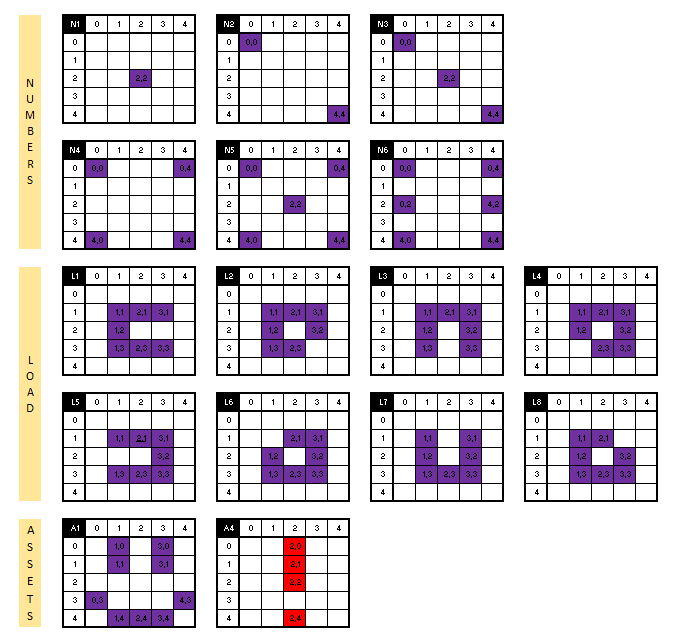

# IOT - DICE 

Hardware: M5Stack AtomMatrix

https://shop.m5stack.com/products/atom-matrix-esp32-development-kit

A simple program for throw dice using C# .NET with nanoFramework!

  

Vectors used to recreate the animations

  

